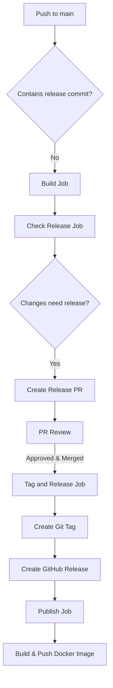
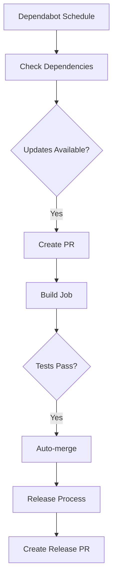

# Release Workflow Documentation

## Overview

This document describes the automated release process, including how Dependabot updates are handled and how releases are created.

## Workflow Components

### 1. Dependabot

- **Configuration**: `.github/dependabot.yml`
- **Frequency**: Weekly checks on Mondays at 9 AM PT
- **Monitors**:
  - Python dependencies in `/pr-diff-bot`
  - GitHub Actions in `/`
- **Behavior**:
  - Groups updates together to minimize PRs
  - Creates PRs with `fix` prefix
  - Adds appropriate labels (dependencies, python/github-actions)

### 2. Release Process

#### A. Normal Code Changes



#### B. Dependabot Updates



## Job Details

### 1. Build Job

- Runs on:
  - Push to main
  - Pull request events
  - Workflow dispatch
- Tasks:
  - Install dependencies
  - Build Docker image
  - Cache layers

### 2. Check Release Job

- Runs when:
  - Push to main (non-release commits)
- Tasks:
  - Check commit messages for `fix:` or `feat:`
  - Calculate next version number
  - Determine if release needed

### 3. Create Release PR Job

- Creates PR with:
  - Version bump in **init**.py
  - Changelog of changes since last release
  - Branch name: `release-{version}`

### 4. Tag and Release Job

- Runs when:
  - Release PR is merged
- Tasks:
  - Create git tag
  - Create GitHub release
  - Generate changelog

### 5. Publish Job

- Runs after:
  - Successful tag creation
- Tasks:
  - Build Docker image
  - Push to GitHub Container Registry
  - Tag with version and latest

## Version Calculation

1. **Patch Version** (0.1.0 -> 0.1.1)

   - Triggered by `fix:` commits
   - Used for bug fixes and minor improvements
   - Also used by Dependabot updates

2. **Minor Version** (0.1.0 -> 0.2.0)

   - Triggered by `feat:` commits
   - Used for new features

3. **Major Version** (0.1.0 -> 1.0.0)
   - Triggered by breaking changes
   - Manual process

## Release Artifacts

1. **Git Tag**

   - Format: `v{version}` (e.g., v0.1.1)
   - Created after release PR merge

2. **GitHub Release**

   - Title: Release v{version}
   - Contains changelog
   - Links to Docker image

3. **Docker Image**
   - Repository: ghcr.io/{repo}
   - Tags:
     - :latest
     - :{version}

## Automation Flow

1. **Code Changes**

   ```
   Push to main -> Build -> Check Release -> Release PR -> Review -> Tag -> Publish
   ```

2. **Dependency Updates**
   ```
   Dependabot -> PR -> Build -> Auto-merge -> Release Process
   ```

## Security Considerations

1. **Permissions**

   - GitHub Token: Basic workflow permissions
   - PAT Token: Required for releases and PR creation
   - Docker: Package write permissions

2. **Protected Branches**
   - Main branch protected
   - Requires PR for changes
   - Requires build checks to pass

## Best Practices

1. **Commit Messages**

   - Use conventional commits
   - Prefix with type (fix:, feat:)
   - Clear and descriptive

2. **Pull Requests**

   - Review release PRs
   - Check version bumps
   - Verify changelog

3. **Releases**
   - Keep changelog up to date
   - Test Docker images
   - Monitor Dependabot PRs
